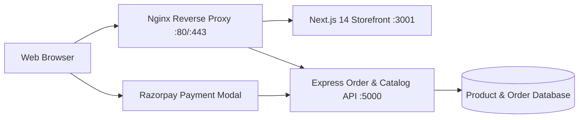

# Rose Chemicals: Animated Minimalist E-Commerce & Production Platform 🧪🌸

<div align="center">

[](https://nextjs.org/)
[](https://react.dev)
[](https://tailwindcss.com/)
[](https://razorpay.com/)
[](https://pm2.keymetrics.io/)

**High-Performance Animated E-Commerce Portal & Production Backend for Rose Chemicals.**

🌐 **Live Store:** [https://rosechemicals.in](https://rosechemicals.in)

</div>

---

## 📖 Overview

**Rose Chemicals** is a premier manufacturer and wholesale distributor of industrial solvents, household disinfectants, and institutional cleaning chemicals based in South India.

This repository powers the complete digital commerce experience for Rose Chemicals—delivering an animated, minimalist storefront built with **Next.js 14** and **Framer Motion**, backed by an **Express.js** administrative API and **Razorpay** payment gateway integration. The repository also houses production Linux VPS deployment scripts, Nginx reverse-proxy topologies, and PM2 process management configurations.

---

## 🌟 Key Features

- 🛍️ **Modern Fluid Storefront**: Next.js 14 App Router with server-side rendering (SSR) and dynamic metadata for optimal SEO (`schema-dts`).
- 💳 **Razorpay Payment Gateway**: Seamless checkout experience handling UPI, credit/debit cards, NetBanking, and corporate purchasing accounts.
- 📦 **B2B & Retail Volume Tiers**: Dynamic price calculation supporting bulk industrial canister orders and retail bottle packages.
- 🛡️ **Administrative CMS & Backend**: Dedicated Express server in `/backend` for product inventory management, stock synchronization, and customer order tracking.
- 🚀 **Production VPS Automation**: Turnkey deployment pipelines (`deploy-to-vps.sh`, `deploy-from-windows.ps1`) with Nginx SSL caching and PM2 process persistence.

---

## 🛠️ Architecture & Tech Stack



- **Frontend**: Next.js 14, React 18, Tailwind CSS, Framer Motion, Lucide React, Heroicons.
- **Backend API**: Node.js, Express, Razorpay SDK, CORS.
- **Process Orchestration**: PM2 cluster mode via `ecosystem.config.js`.
- **Infrastructure**: Ubuntu VPS, Nginx, Let's Encrypt SSL, Linux systemd.

---

## 📂 Repository Structure

```
Rose-Chemicals/
├── app/                        # Next.js 14 App Router routes & layout
├── backend/                    # Express backend API server
│   ├── routes/                 # Order & product endpoints
│   └── server.js               # API entry point
├── components/                 # Reusable UI components (Cart, Navbar, ProductCards)
├── docs/                       # Architecture diagrams & API references
├── public/                     # Product imagery, logos, brand assets
├── deploy-to-vps.sh            # Production deployment shell script
├── deploy-from-windows.ps1     # PowerShell deployment utility for Windows
├── ecosystem.config.js         # PM2 process configuration
├── nginx_domain.conf           # Production Nginx reverse-proxy configuration
├── VPS-DEPLOYMENT-GUIDE.md     # Server configuration runbook
└── package.json                # Frontend package manifest
```

---

## 🚀 Getting Started

### Local Development

```bash
# 1. Clone repository
git clone https://github.com/A-Generative-Slice/Rose-Chemicals.git
cd Rose-Chemicals

# 2. Install all dependencies (Frontend + Backend)
npm run install:all

# 3. Start Frontend & Backend concurrently
npm run dev:all
```

- **Storefront**: `http://localhost:3001`
- **Backend API**: `http://localhost:5000`

### Running Components Separately

```bash
# Run Next.js frontend only:
npm run dev

# Run Express backend only:
npm run backend
```

---

## 🚢 VPS Deployment

To deploy updates to the live production server:

```bash
# From a Windows developer machine:
.\deploy-from-windows.ps1

# Or directly on the Linux host:
./deploy-to-vps.sh
```

See [VPS-DEPLOYMENT-GUIDE.md](./VPS-DEPLOYMENT-GUIDE.md) for full server configuration instructions.

---

## 📄 License & Attribution

Designed and engineered by **A Generative Slice** for **Rose Chemicals**.  
Copyright © 2026 Rose Chemicals & A Generative Slice. All rights reserved.
